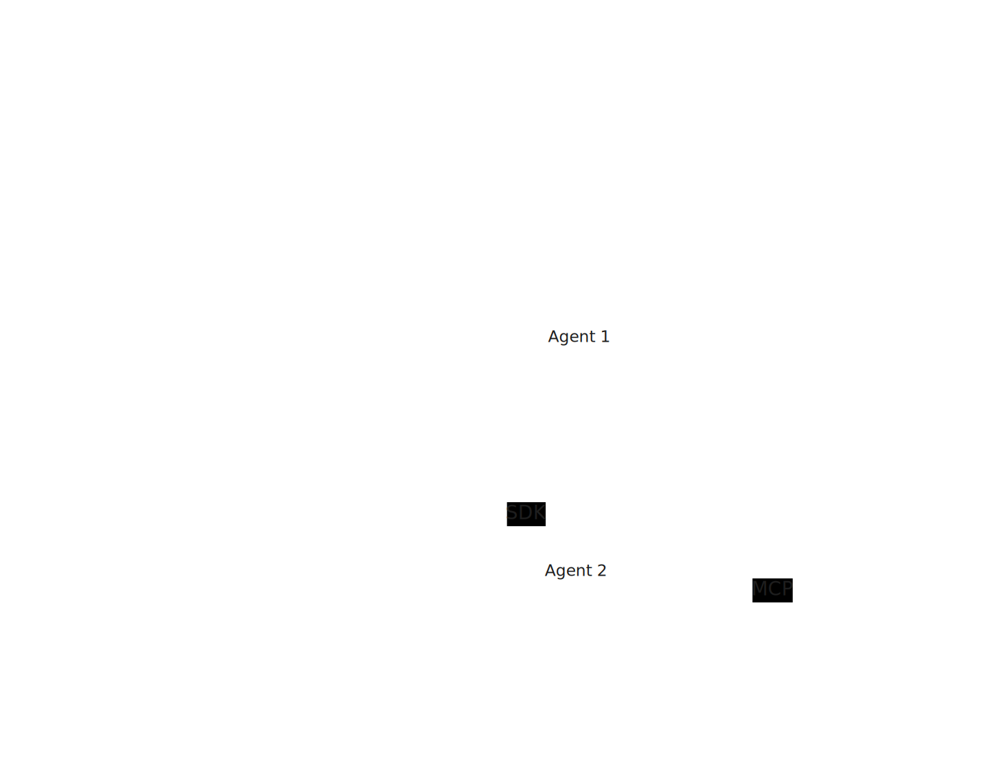

# AI Agents Circus

Run AI coding agents in sandboxed containers with full control over
what they can see and reach.

Agent Circus wraps each agent in its own Docker container, giving you
a reproducible, isolated environment that works across machines and
projects. You decide which files agents can access, secrets stay on
the host, and a built-in firewall restricts outbound network access to
known-good destinations.

Getting started takes two commands. No files are written to your
project, no manual Docker setup required. Customize per-project only
when you need to.

Currently supported agents:

- [Claude Code](https://docs.anthropic.com/en/docs/claude-code) (Anthropic)
- [Codex](https://openai.com/codex/) (OpenAI)
- [Vibe CLI](https://docs.mistral.ai/mistral-vibe/introduction) (Mistral)

IDEs interface with agents via the [Agent Client Protocol](https://agentclientprotocol.com/) (ACP).

## Open Protocols

Agent Circus is built around open interfaces instead of editor- or
vendor-specific integrations. ACP provides a common protocol layer
between editors and coding agents, while MCP provides a standard way
to connect tools and services into agent workflows.

<p align="center">
  
</p>

## Authentication

Each agent authenticates against its vendor's API using the
credentials already present on the host. Agent Circus bind-mounts the
vendor-specific configuration directory from the host into the
corresponding container:

| Agent       | Host directory | Container path         |
|-------------|----------------|------------------------|
| Claude Code | `~/.claude`    | `/home/node/.claude`   |
| Codex       | `~/.codex`     | `/home/node/.codex`    |
| Vibe CLI    | `~/.vibe`      | `/home/node/.vibe`     |

This means you only need to authenticate once on the host (e.g. by
running `claude` or `codex` locally) and the containerized agents will
pick up the same session and API keys automatically.

## Getting Started

### Installing the `agent-circus` Tool

``` shell
uv tool install .
```

See the [uv tool documentation](https://docs.astral.sh/uv/concepts/tools/) on how to work with tools in general.

After installing you can start right away in one of your projects
([instant mode](#instant-mode)):

``` shell
agent-circus build
agent-circus exec claude-code -- claude-code-acp
```

The `exec` command automatically starts the container if it is not
running yet. There is no separate `up` step needed.

**Note:** Auto-started containers are not automatically removed when
they are no longer in use. Run `agent-circus remove` to clean up idle
containers.

### Uninstalling

In case you want to get rid of it:

``` shell
uv tool uninstall agent-circus
```

## Working with the Environment

There are two modes of operation:

### Instant Mode

Instant mode uses the templates bundled in the `agent-circus` package
directly. No files are written to your project directory. Just run
commands against any workspace:

``` shell
# Build container images
agent-circus build

# Execute a command in a container (starts it automatically)
agent-circus exec claude-code -- claude-code-acp
agent-circus exec codex -- codex-acp
agent-circus exec -T claude-code -- echo hello   # non-interactive

# Optionally start containers ahead of time
agent-circus up                           # start all services
agent-circus up claude-code               # start a single service

# Show status of agent containers
agent-circus ps

# Remove all related resources
agent-circus remove
agent-circus remove --volumes             # also remove named volumes
agent-circus remove --force               # don't ask for permission
```

### Deploy Mode

Deploy mode copies configuration files into a `.agent-circus/`
directory inside your project. Use this if you need to customize the
`Dockerfile` or `compose.yaml` per project.

``` shell
# Deploy configuration files to the workspace
agent-circus init --deploy

# All other commands work the same; deploy mode is auto-detected
agent-circus build
agent-circus exec claude-code -- claude-code-acp

# Remove containers and deployed files
agent-circus remove --destroy             # remove containers + .agent-circus/
agent-circus remove --destroy --force     # don't ask for permission
```

When both a deployed `.agent-circus/` directory and instant mode are
available, deploy mode takes priority.

## Configuration

Agent Circus can be configured via TOML files. Settings are resolved
in this order (last wins):

1. **User-global** — `$XDG_CONFIG_HOME/agent-circus/config.toml`
   (default: `~/.config/agent-circus/config.toml`)
2. **Project-local** — `.agent-circus/config.toml` in the workspace

CLI flags override both.

### Shadowing Files

The `shadow` setting prevents host files from leaking into containers
by overlaying them with `/dev/null` bind mounts:

``` toml
shadow = [".env", ".env.local"]
```

This is useful for keeping API keys and other secrets in `.env` files
out of agent containers.

### MCP Servers

[MCP](https://modelcontextprotocol.io/) servers run as sidecar
containers. Agent Circus starts them automatically and injects the
server URLs into every agent's native configuration.

Add entries to `config.toml`:

``` toml
[[mcp_servers]]
name = "filesystem"
image = "mcp/filesystem:latest"
```

Optional fields: `port` (default `8080`), `transport` (default
`streamable-http`), `path` (default `/mcp`), `env`, `command`,
`volumes`.

Check running sidecars with `agent-circus ps --mcp`.

## Setting up Editors to Work with ACP

### Emacs

This is a working [agent-shell](https://github.com/xenodium/agent-shell) configuration based `agent-circus`:

``` emacs-lisp
(defconst rpo/agent-shell--container-workspace-path "/workspace/"
  "The workspace path inside agent containers.")

(defun rpo/agent-shell--resolve-container-path (path)
  "Resolve PATH between local filesystem and container workspace.

For example:

- /workspace/README.md
    => /home/xenodium/projects/kitchen-sink/README.md
- /home/xenodium/projects/kitchen-sink/README.md
    => /workspace/README.md"
  (let ((cwd (agent-shell-cwd)))
    (if (string-prefix-p cwd path)
        ;; Local -> container
        (string-replace cwd rpo/agent-shell--container-workspace-path path)
      ;; Container -> local
      (if agent-shell-text-file-capabilities
          (if-let* ((_ (string-prefix-p rpo/agent-shell--container-workspace-path path))
                    (local-path (expand-file-name
                                 (string-replace rpo/agent-shell--container-workspace-path cwd path))))
              (or
               (and (file-in-directory-p local-path cwd) local-path)
               (error "Resolves to path outside of working directory: %s" path))
            (error "Unexpected path outside of workspace folder: %s" path))
        (error "Refuse to resolve to local filesystem with text file capabilities disabled: %s" path)))))

(defun rpo/agent-shell-circus-runner-multi (buffer)
  "Return the docker compose command prefix to run for BUFFER's agent.

Looks up the agent identifier in BUFFER's `agent-shell' config and
selects the matching service using `agent-circus exec`, defaulting to
\"claude-code\" when no identifier-specific override is found.

Works in both instant mode and deploy mode."
  (let* ((cfg (agent-shell-get-config buffer))
         (id  (map-elt cfg :identifier))
         (service
          (pcase id
            ('claude-code "claude-code")
            ('codex "codex")
            ('mistral-vibe "mistral-vibe")
            (_ "claude-code"))))
    (list "agent-circus" "exec" service "--")))

(use-package agent-shell
  :ensure t
  :config
  (setq agent-shell-mistral-authentication
        (agent-shell-mistral-make-authentication :api-key "ignored"))
  (setq acp-logging-enabled t)
  (setq agent-shell-container-command-runner #'rpo/agent-shell-circus-runner-multi)
  (setq agent-shell-path-resolver-function #'rpo/agent-shell--resolve-container-path)
  (setq agent-shell-file-completion-enabled t))
```

## Disclosure: AI-Assisted Development

This project is in large parts AI-generated code.

However, I as a human, manage the architecture and perform code reviews of those parts which are generated by AI.

Furthermore, this is a self-hosting project. Agents working on this project are running inside what `agent-circus` provides.

To reduce model risk, AI systems from different vendors are assigned distinct roles in the development process (implementation, testing, and security review).
