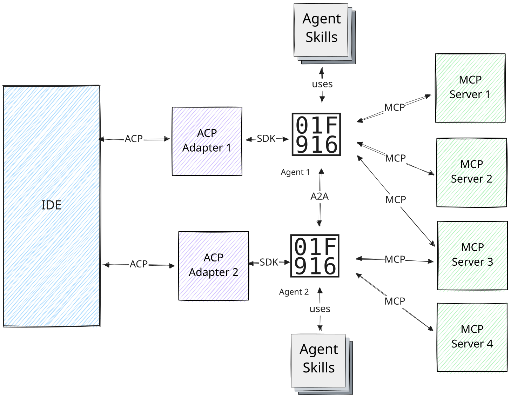

# AI Agents Circus

Run AI coding agents in sandboxed containers with full control over
what they can see and reach.

Agent Circus wraps each agent in its own Docker container, giving you
a reproducible, isolated environment that works across machines and
projects. You decide which files agents can access, secrets stay on
the host, and a built-in firewall restricts outbound network access to
known-good destinations.

Getting started takes two commands. No files are written to your
project, no manual Docker setup required. Customize per-project only
when you need to.

Currently supported agents:

- [Claude Code](https://docs.anthropic.com/en/docs/claude-code) (Anthropic)
- [Codex](https://openai.com/codex/) (OpenAI)
- [Vibe CLI](https://docs.mistral.ai/mistral-vibe/introduction) (Mistral)
- [OpenCode](https://opencode.ai/) (SST)

IDEs interface with agents via the [Agent Client Protocol](https://agentclientprotocol.com/) (ACP).

## Open Protocols

Agent Circus is built around open interfaces instead of editor- or
vendor-specific integrations. ACP provides a common protocol layer
between editors and coding agents, while MCP provides a standard way
to connect tools and services into agent workflows.

<p align="center">
  
</p>

## Authentication

Each agent authenticates against its vendor's API using the
credentials already present on the host. Agent Circus bind-mounts the
vendor-specific configuration directory from the host into the
corresponding container:

| Agent       | Host directory       | Container path                |
|-------------|----------------------|-------------------------------|
| Claude Code | `~/.claude`          | `/home/node/.claude`          |
| Codex       | `~/.codex`           | `/home/node/.codex`           |
| Vibe CLI    | `~/.vibe`            | `/home/node/.vibe`            |
| OpenCode    | `~/.config/opencode` | `/home/node/.config/opencode` |

This means you only need to authenticate once on the host (e.g. by
running `claude`, `codex`, or `opencode` locally) and the containerized agents will
pick up the same session and API keys automatically.

## Getting Started

### Installing the `agent-circus` Tool

``` shell
uv tool install .
```

See the [uv tool documentation](https://docs.astral.sh/uv/concepts/tools/) on how to work with tools in general.

After installing you can start right away in one of your projects
([instant mode](#instant-mode)):

``` shell
agent-circus build
agent-circus exec claude-code -- claude-agent-acp
```

The `exec` command automatically starts the container if it is not
running yet. There is no separate `up` step needed.

**Note:** Auto-started containers are not automatically removed when
they are no longer in use. Run `agent-circus remove` to clean up idle
containers.

### Uninstalling

In case you want to get rid of it:

``` shell
uv tool uninstall agent-circus
```

## Working with the Environment

There are two modes of operation:

### Instant Mode

Instant mode uses the templates bundled in the `agent-circus` package
directly. No files are written to your project directory. Just run
commands against any workspace:

``` shell
# Build container images
agent-circus build

# Execute a command in a container (starts it automatically)
agent-circus exec claude-code -- claude-agent-acp
agent-circus exec codex -- codex-acp
agent-circus exec opencode -- opencode
agent-circus exec -T claude-code -- echo hello   # non-interactive

# Optionally start containers ahead of time
agent-circus up                           # start all services
agent-circus up claude-code               # start a single service

# Show status of agent containers
agent-circus ps

# Remove all related resources
agent-circus remove
agent-circus remove --volumes             # also remove named volumes
agent-circus remove --force               # don't ask for permission
```

### Deploy Mode

Deploy mode copies configuration files into a `.agent-circus/`
directory inside your project. Use this if you need to customize the
`Dockerfile` or `compose.yaml` per project.

``` shell
# Deploy configuration files to the workspace
agent-circus init --deploy

# All other commands work the same; deploy mode is auto-detected
agent-circus build
agent-circus exec claude-code -- claude-agent-acp

# Remove containers and deployed files
agent-circus remove --destroy             # remove containers + .agent-circus/
agent-circus remove --destroy --force     # don't ask for permission
```

When both a deployed `.agent-circus/` directory and instant mode are
available, deploy mode takes priority.

## Configuration

Agent Circus can be configured via TOML files. Settings are resolved
in this order (last wins):

### Initialising config with `init`

Rather than editing `config.toml` by hand, use `agent-circus init` flags to
write common options directly. This creates `.agent-circus/config.toml`
(and the directory, if absent) without copying any template files — instant
mode continues to work alongside a `config.toml`.

``` sh
# Enable SSH agent forwarding
agent-circus init --ssh

# SSH forwarding with config and known_hosts passthrough
agent-circus init --ssh \
  --ssh-config ~/.ssh/config \
  --ssh-known-hosts ~/.ssh/known_hosts

# Shadow secret files
agent-circus init --shadow .env --shadow .env.local

# Git config with commit signing
agent-circus init --git --git-signing-key ~/.ssh/id_ed25519.pub

# Combine with full deploy
agent-circus init --deploy --ssh --git --shadow .env
```

All flags are additive and idempotent: running them again merges into the
existing `config.toml` without overwriting unrelated keys.

| Flag | Description |
|---|---|
| `--ssh` | Add `[ssh]` table to enable SSH agent forwarding |
| `--ssh-config PATH` | Set `ssh.config_path` (implies `--ssh`) |
| `--ssh-known-hosts PATH` | Set `ssh.known_hosts_path` (implies `--ssh`) |
| `--shadow TEXT` | Append a path to the `shadow` list (repeatable) |
| `--git` | Add `[git]` table to enable Git config forwarding |
| `--git-config PATH` | Set `git.config_path` (implies `--git`) |
| `--git-signing-key PATH` | Set `git.signing_key_path` (implies `--git`) |
| `--hosts-pattern TEXT` | Append a pattern to `hosts.patterns` (repeatable) |
| `--ca-cert-pattern TEXT` | Append a pattern to `ca_certs.patterns` (repeatable) |
| `--env-pattern TEXT` | Append a pattern to `env_passthrough` (repeatable) |
| `--git-worktree-mirror` | Set `git.worktree_mirror = true` and write `AGENTS.md` |

1. **User-global** — `$XDG_CONFIG_HOME/agent-circus/config.toml`
   (default: `~/.config/agent-circus/config.toml`)
2. **Project-local** — `.agent-circus/config.toml` in the workspace

CLI flags override both.

### Shadowing Files

The `shadow` setting prevents host files from leaking into containers
by overlaying them with `/dev/null` bind mounts:

``` toml
shadow = [".env", ".env.local"]
```

This is useful for keeping API keys and other secrets in `.env` files
out of agent containers.

### MCP Servers

[MCP](https://modelcontextprotocol.io/) servers run as sidecar
containers. Agent Circus starts them automatically and injects the
server URLs into every agent's native configuration.

Add entries to `config.toml`:

``` toml
[[mcp_servers]]
name = "filesystem"
image = "mcp/filesystem:latest"
```

Optional fields: `port` (default `8080`), `transport` (default
`streamable-http`), `path` (default `/mcp`), `env`, `command`,
`volumes`.

Check running sidecars with `agent-circus ps --mcp`.

### Additional Directories

Use the `[[additional_dirs]]` array to mount extra host directories into
every agent container. Directories appear under `/workspaces/<name>` alongside
the primary project at `/workspace`.

``` toml
[[additional_dirs]]
path = "/home/user/shared-libs"
readonly = true

[[additional_dirs]]
path = "/home/user/other-project"
# readonly defaults to false
# name defaults to the basename of path
name = "other-project"
```

Fields:

| Field | Required | Default | Description |
|-------|----------|---------|-------------|
| `path` | yes | — | Absolute path on the host |
| `readonly` | no | `false` | Mount read-only when `true` |
| `name` | no | basename of `path` | Container mount name (`/workspaces/<name>`) |

### SSH Agent Forwarding

Add an `[ssh]` table to `config.toml` to forward your host SSH agent into
agent containers. This lets agents interact with Git servers (e.g. GitHub)
over SSH without any key material entering the container — all private key
operations stay on the host.

``` toml
[ssh]
```

The host's SSH agent socket (`$SSH_AUTH_SOCK`) is mounted read-only at
`/run/ssh-agent.sock` inside each container, and `SSH_AUTH_SOCK` is set
accordingly.

> **Note:** `SSH_AUTH_SOCK` must be set in your environment when running
> `agent-circus`. If it is not, agent-circus will report an error.

#### Starting an SSH agent on the host

**Linux — desktop session (GNOME, KDE, etc.)**

Most desktop environments start an SSH agent automatically as part of the
session. `SSH_AUTH_SOCK` is usually already set; verify with:

``` sh
echo $SSH_AUTH_SOCK
```

**Linux — systemd user service**

For headless or server setups, enable the systemd SSH agent user service:

``` sh
systemctl --user enable --now ssh-agent
```

Add the following to your shell profile (e.g. `~/.bashrc` or `~/.zshrc`) to
make the socket available in new shells:

``` sh
export SSH_AUTH_SOCK="$XDG_RUNTIME_DIR/ssh-agent.socket"
```

**Linux — manual (one-off)**

Start a temporary agent in your current shell session:

``` sh
eval $(ssh-agent)
```

**macOS**

macOS integrates the system keychain as an SSH agent; `SSH_AUTH_SOCK` is set
automatically in GUI and terminal sessions. No extra setup is needed.

#### Loading keys into the agent

Once the agent is running, add your key(s):

``` sh
ssh-add ~/.ssh/id_ed25519
# or to add all default keys:
ssh-add
```

On macOS you can persist keys across reboots in the keychain:

``` sh
ssh-add --apple-use-keychain ~/.ssh/id_ed25519
```

#### Passing SSH config and known_hosts

By default only the agent socket is forwarded. To also make your SSH config
and known hosts available inside containers, add the optional fields:

``` toml
[ssh]
config_path = "~/.ssh/config"
known_hosts_path = "~/.ssh/known_hosts"
```

Both fields are optional and independent of each other. Tilde (`~`) is
expanded to your home directory. The files are mounted read-only at
intermediate paths and copied into `/home/node/.ssh/` at container startup
with correct ownership — no key material is involved.

> **Rebuild required**: The copy logic lives in `docker-entrypoint.sh`
> which is baked into the image. Run `agent-circus build` after enabling
> these options for the first time.

> **IdentityFile directives**: If your `~/.ssh/config` references local key
> paths (e.g. `IdentityFile ~/.ssh/id_ed25519`), those paths won't exist
> inside the container. This is harmless — SSH falls back to the forwarded
> agent automatically when a referenced file is absent.

### Git Configuration

Add a `[git]` table to `config.toml` to forward your host Git configuration
into agent containers, giving agents the correct identity for commits and
enabling SSH commit signing.

``` toml
[git]
config_path = "~/.gitconfig"              # optional, defaults to ~/.gitconfig
signing_key_path = "~/.ssh/id_ed25519.pub"  # optional
worktree_mirror = true                    # optional, see below
```

The host gitconfig is mounted read-only at `/run/git-host/config`. At container
startup the entrypoint generates `/home/node/.gitconfig` using git's native
`[include]` mechanism:

``` ini
[include]
    path = /run/git-host/config
[user]
    signingkey = /run/git-host/signingkey.pub   # only when signing_key_path is set
```

All portable settings (name, email, aliases, …) flow through the include
unchanged. Only `user.signingkey` is overridden to point to the container-local
path, resolving the host-absolute-path issue without rewriting the original file.

> **Rebuild required**: The entrypoint logic is baked into the image.
> Run `agent-circus build` after enabling `[git]` for the first time.

> **`[include]` directives** in your gitconfig that reference other host paths
> (e.g. `~/.gitconfig.local`) will silently produce no-ops inside the container.
> Extract the portable parts into the forwarded file or use `config_path` to
> point at a dedicated container-friendly config.

#### Worktree support (`worktree_mirror`)

Set `worktree_mirror = true` when the repository is also used outside the
containers and you need transparent Git worktree support.

This adds a second bind mount for the workspace at its exact host absolute path
inside every agent container (in addition to the standard `/workspace` mount).
Both paths point to the same directory, so Git's recorded absolute paths are
valid inside the container — `git worktree list`, `git worktree add`, and all
other operations that consume or emit absolute paths work without any manual
path rewriting.

Enable it via `agent-circus init`:

``` sh
agent-circus init --git-worktree-mirror
```

This also writes a managed `## Git Operations` section to `AGENTS.md` in the
workspace, instructing agents to use the host path (e.g.
`/home/user/projects/myrepo`) rather than `/workspace` for Git operations.
The section is bounded by HTML comment markers and updated idempotently on
subsequent runs.

> **Note:** The host path of the workspace is embedded in `AGENTS.md` at init
> time. Re-run `agent-circus init --git-worktree-mirror` if the repository is
> moved to a different location on the host.

### CA Certificates

Add a `[ca_certs]` table to `config.toml` to forward selected CA certificates from the
host into agent containers. This is needed when agents make HTTPS requests to internal
services signed by a private or corporate CA.

``` toml
[ca_certs]
patterns = ["corp-*.crt", "my-vpn-ca.crt", "re:internal"]
# path = "/usr/local/share/ca-certificates"   # optional, defaults as above
```

Certificates whose **filename** matches a pattern are bind-mounted at
`/run/ca-host/<filename>` and installed into the container's system trust store by the
entrypoint (`update-ca-certificates`), making them trusted for all tools (curl, git,
npm, etc.).

Pattern syntax is the same as `[hosts]`: fnmatch glob by default, `re:` prefix for regex.

Use `agent-circus init` to write patterns:

``` sh
agent-circus init --ca-cert-pattern "corp-*.crt" --ca-cert-pattern "vpn-ca.crt"
```

> **Rebuild required**: `install-ca-certs.sh` and its sudoers rule are baked into the
> image. Run `agent-circus build` after enabling `[ca_certs]` for the first time.

### Host Entries

Add a `[hosts]` table to `config.toml` to forward selected entries from the host's
`/etc/hosts` into agent containers. This is useful for reaching internal servers, VPN
targets, or other hosts that are only resolvable on the host machine.

``` toml
[hosts]
patterns = ["*.corp.internal", "myserver", "re:\\.vpn\\.example\\.com$"]
# file = "/etc/hosts"   # optional, defaults to /etc/hosts
```

Matching entries are injected via Docker Compose's `extra_hosts` mechanism, which adds
them to `/etc/hosts` inside every agent container.

**Pattern syntax:**

| Pattern | Syntax | Example |
|---------|--------|---------|
| `*.corp.internal` | fnmatch glob (default) | matches `foo.corp.internal` |
| `myserver` | exact glob | matches only `myserver` |
| `re:\.vpn\.` | Python regex (prefix `re:`) | matches any name containing `.vpn.` |

- Matching is case-insensitive.
- If **any** name on a hosts line matches, **all** names from that line are forwarded
  (e.g. if `myserver.corp.internal` matches, `myserver` is also forwarded — preserving
  alias semantics).

Use `agent-circus init` to write patterns without editing `config.toml` directly:

``` sh
agent-circus init --hosts-pattern "*.corp.internal" --hosts-pattern "myserver"
```

The flag is additive and idempotent: running it again merges new patterns without
duplicating existing ones.

### Environment Variables

Two complementary mechanisms control environment variables in containers:

| Mechanism | When | Use for |
|-----------|------|---------|
| `[env]` table | **Build time** — baked into the image as `ENV` instructions | Stable toolchain paths, non-secret config |
| `env_passthrough` list | **Runtime** — forwarded from the host when the container starts | Secrets, tokens, values that change per session |

#### `[env]` — bake into the image

Each entry is injected as a Docker `ENV` instruction at the end of the base build stage,
so `$VARNAME` is expanded relative to the image's current value — not the host shell.

``` toml
[env]
GOPATH = "/home/node/go"
PATH = "/usr/local/go/bin:$PATH"
```

This only affects **instant mode**. In deploy mode add `ENV` lines directly to
`.agent-circus/Dockerfile`.

#### `env_passthrough` — forward from the host at runtime

Variable **values** are never stored in any config or override file — Docker Compose
reads them directly from the host environment when the container starts.

``` toml
env_passthrough = ["MY_CORP_*", "re:^VAULT_", "ANTHROPIC_API_KEY"]
```

Pattern syntax is the same as `[hosts]` and `[ca_certs]`: fnmatch glob by default,
`re:` prefix for regex, case-insensitive.

``` sh
agent-circus init --env-pattern "MY_CORP_*" --env-pattern "re:^VAULT_"
```

#### Combined example

A typical Go project that needs a corporate proxy and a rotating API token:

``` toml
# Bake the Go toolchain path into the image once (stable, non-secret).
[env]
GOPATH = "/home/node/go"
PATH = "/usr/local/go/bin:$PATH"
GOPROXY = "https://proxy.corp.internal/go,direct"

# Forward secrets and session-specific values from the host at runtime.
env_passthrough = ["ANTHROPIC_API_KEY", "MY_CORP_*", "re:^VAULT_"]
```

### `[logging]` — log level and file

Control logging from your user-global `config.toml`
(`~/.config/agent-circus/config.toml`):

``` toml
[logging]
level = "DEBUG"                      # DEBUG | INFO | WARNING | ERROR | CRITICAL
file  = "/tmp/agent-circus.log"      # optional; omit to log to stdout only
```

The `--log-level` and `--log-file` CLI flags (and their `LOGLEVEL` / `LOGFILE`
environment variables) take precedence over `config.toml`.  This section is
read from the **user-global** config only — project-local logging config is
not supported because logging is initialised before the workspace is known.

## Hooks

Hooks let you inject custom shell commands into the Docker image build,
without modifying the shared `Dockerfile`.

| Script | Runs as | When | Typical use |
|---|---|---|---|
| `base-root.sh` | `root` | Build time | Install apt packages, system-level configuration |
| `base-user.sh` | `node` | Build time | Install npm/uv/pip packages, user-level tooling |
| `startup.sh` | `node` | Container start | Project-specific runtime setup |

Build scripts are optional and removed from the image after execution.
`startup.sh` is read directly from the bind-mounted workspace at container
start — changes take effect immediately without a rebuild.

### Inline hooks via `config.toml` (instant mode)

In instant mode you can define hook content directly in `config.toml` using
the `[hooks]` table.  This works without a `.agent-circus/` directory and is
ideal for user-global hooks that apply to every project:

``` toml
[hooks]
base_root = """
apt-get update && apt-get install -y ripgrep fd-find
"""

base_user = """
npm install -g @myorg/custom-tool
curl -fsSL https://my-tool.sh | sh
"""

startup = """
uv sync
"""
```

Values are multi-line TOML strings written verbatim as shell scripts. A
`#!/usr/bin/env bash` shebang is prepended automatically when absent.  If
both a `[hooks]` table and project hook files exist, `config.toml` wins.

> **Note:** `startup.sh` defined in `config.toml` is written to the XDG state
> directory and bind-mounted into the container at
> `/workspace/.agent-circus/hooks/startup.sh`. It takes precedence over any
> `startup.sh` file in the workspace. `base_root` and `base_user` are ignored
> in deploy mode — place those scripts in `.agent-circus/hooks/` directly.

### Hook files (deploy mode)

In deploy mode, place scripts under `.agent-circus/hooks/`:

``` shell
# .agent-circus/hooks/base-root.sh
apt-get update \
    && apt-get install -y ripgrep
```

``` shell
# .agent-circus/hooks/base-user.sh
npm install -g @myorg/custom-tool
```

``` shell
# .agent-circus/hooks/startup.sh
# Sync project dependencies and start an SSH tunnel to an internal host.
uv sync
autossh -M 0 -f -N -L 5432:db.internal:5432 tunnel-user@bastion.internal
```

## Setting up Editors to Work with ACP

### Emacs

This is a working [agent-shell](https://github.com/xenodium/agent-shell) configuration based `agent-circus`:

``` emacs-lisp
(defconst rpo/agent-shell--container-workspace-path "/workspace/"
  "The workspace path inside agent containers.")

(defun rpo/agent-shell--resolve-container-path (path)
  "Resolve PATH between local filesystem and container workspace.

For example:

- /workspace/README.md
    => /home/xenodium/projects/kitchen-sink/README.md
- /home/xenodium/projects/kitchen-sink/README.md
    => /workspace/README.md"
  (let ((cwd (agent-shell-cwd)))
    (if (string-prefix-p cwd path)
        ;; Local -> container
        (string-replace cwd rpo/agent-shell--container-workspace-path path)
      ;; Container -> local
      (if agent-shell-text-file-capabilities
          (if-let* ((_ (string-prefix-p rpo/agent-shell--container-workspace-path path))
                    (local-path (expand-file-name
                                 (string-replace rpo/agent-shell--container-workspace-path cwd path))))
              (or
               (and (file-in-directory-p local-path cwd) local-path)
               (error "Resolves to path outside of working directory: %s" path))
            (error "Unexpected path outside of workspace folder: %s" path))
        (error "Refuse to resolve to local filesystem with text file capabilities disabled: %s" path)))))

(defun rpo/agent-shell-circus-runner-multi (buffer)
  "Return the agent-circus exec command prefix to run for BUFFER's agent.

Looks up the agent identifier in BUFFER's `agent-shell' config and
selects the matching `agent-circus exec` service, defaulting to
\"claude-code\" when no identifier-specific override is found.

Works in both instant mode and deploy mode."
  (let* ((cfg (agent-shell-get-config buffer))
         (id  (map-elt cfg :identifier))
         (service
          (pcase id
            ('claude-code "claude-code")
            ('codex "codex")
            ('mistral-vibe "mistral-vibe")
            ('opencode "opencode")
            (_ "claude-code"))))
    (list "agent-circus" "--log-level" "DEBUG" "--log-file" "/tmp/agent-circus.log" "exec" service "--")))

(use-package agent-shell
  :ensure t
  :config
  (setq agent-shell-mistral-authentication
        (agent-shell-mistral-make-authentication :api-key "ignored"))
  (setq acp-logging-enabled t)
  (setq agent-shell-command-prefix #'rpo/agent-shell-circus-runner-multi)
  (setq agent-shell-path-resolver-function #'rpo/agent-shell--resolve-container-path)
  (setq agent-shell-file-completion-enabled t))
```

## Disclosure: AI-Assisted Development

This project is in large parts AI-generated code.

However, I as a human, manage the architecture and perform code reviews of those parts which are generated by AI.

Furthermore, this is a self-hosting project. Agents working on this project are running inside what `agent-circus` provides.

To reduce model risk, AI systems from different vendors are assigned distinct roles in the development process (implementation, testing, and security review).
